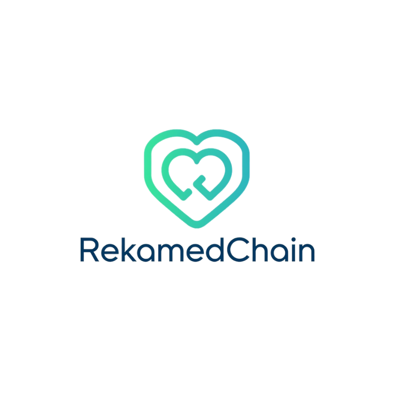

# 🏥 RekamedChain: Sistem Rekam Medis Digital Terdesentralisasi

<p align="center">
  
  <br/>
  <b>RekamedChain</b> — Empowering Patient Data Sovereignty
</p>

**RekamedChain** adalah purwarupa (*Minimum Viable Product*) sistem rekam medis digital yang menempatkan **kedaulatan data pasien sepenuhnya di tangan pasien**, dibangun di atas fondasi teknologi **Blockchain**, **Self-Sovereign Identity (SSI)**, dan **penyimpanan terdesentralisasi (IPFS)**.

---

## 🚩 Latar Belakang Masalah

Sistem kesehatan digital di Indonesia menghadapi tiga tantangan utama:
1. **Fragmentasi data** antar fasilitas kesehatan  
2. **Kerentanan keamanan siber**  
3. **Kurangnya kedaulatan pasien** atas data medisnya  

RekamedChain dikembangkan bukan sekadar perbaikan, melainkan sebagai **lompatan paradigma** dalam manajemen data kesehatan.

---

## 💡 Solusi yang Ditawarkan

RekamedChain mengusung arsitektur **tiga lapis** yang terintegrasi:

### 1. Lapisan Kedaulatan Pasien (SSI)
Setiap pasien memiliki **identitas digital berdaulat** dengan pasangan kunci publik dan privat.  
Kunci privat disimpan di perangkat pasien dan digunakan untuk **tanda tangan digital**, memastikan kontrol penuh atas akses datanya.

### 2. Lapisan Data & Enkripsi (*Off-Chain*)
Data medis sensitif dienkripsi dengan **AES-256**, disimpan di **PostgreSQL**, dan file lampiran tersimpan di **IPFS**.  
Hasilnya: sistem aman, efisien, dan dapat diskalakan.

### 3. Lapisan Integritas & Audit (*On-Chain*)
Setiap transaksi rekam medis menghasilkan **sidik jari digital (hash)** yang dicatat secara permanen di **Smart Contract (Blockchain)** — menciptakan **jejak audit yang tidak dapat dimanipulasi.**

---

## ✨ Fitur Utama (MVP)

| Fitur | Deskripsi Singkat |
|-------|--------------------|
| 🔐 **Autentikasi & Peran** | Login aman berbasis JWT, membedakan `Pasien` dan `Dokter`. |
| 📋 **Manajemen Rekam Medis** | Dokter menambah rekam medis & upload lampiran ke IPFS. |
| 🔒 **Enkripsi Data** | Data diagnosis terenkripsi saat disimpan. |
| 🧾 **Manajemen Izin (Consent)** | Dokter mengajukan izin; pasien menyetujui lewat tanda tangan digital. |
| 👀 **Akses Terkontrol** | Dokter hanya dapat melihat data setelah disetujui pasien. |
| 🪶 **Jejak Audit Transparan** | Semua aktivitas tercatat di ledger blockchain. |

---

## 🛠️ Tumpukan Teknologi

| Komponen | Teknologi |
|-----------|------------|
| **Backend** | Go (Golang), go-ethereum, pgx, net/http |
| **Frontend Web (Dokter)** | Next.js, TypeScript, Tailwind CSS, Shadcn/ui |
| **Frontend Mobile (Pasien)** | React Native, Expo, TypeScript, Ethers.js |
| **Database** | PostgreSQL |
| **Penyimpanan File** | IPFS (Kubo) |
| **Blockchain** | Hardhat, Solidity |
| **Infrastruktur** | Docker, GitHub Actions, ngrok |

---

## 🏗️ Arsitektur Sistem

```text
+----------------+                             +----------------+
|   Pengguna     |                             |   Pengguna     |
|   (Pasien)     |                             |   (Dokter)     |
+-------+--------+                             +--------+-------+
        |                                                |
        v                                                v
+----------------+                             +----------------+
|  Aplikasi Mobile |                             |  Portal Web    |
| (React Native) |                             |  (Next.js)     |
+-------+--------+                             +--------+-------+
        | (via ngrok)                                    | (direct)
        |                                                |
        +---------------------+--------------------------+
                              |
                              v
+------------------------------------------------------------------+
|                        Backend API Gateway (Go)                  |
|                           (Port 8080)                            |
|------------------------------------------------------------------|
|  - Middleware (Auth JWT, Roles, Consent)                         |
|  - Handlers (Login, Records, Upload, Sign, dll)                  |
|  - Logika Enkripsi/Dekripsi (AES)                                |
|  - Reverse Proxy untuk IPFS Gateway (/ipfs/*)                    |
|  - Interaksi dengan Smart Contract (Geth)                        |
+----------------------------------+-------------------------------+
                                   |
           +-----------------------+-----------------------+
           |                       |                       |
           v                       v                       v
+------------------------+ +------------------------+ +------------------------+
|   Database Relasional  | | Penyimpanan File Lanjutan| |    Jaringan Blockchain   |
|      (PostgreSQL)      | |         (IPFS)         | |        (Hardhat)         |
+------------------------+ +------------------------+ +------------------------+
```
## 🚀 Memulai (Getting Started)

### ⚙️ Prasyarat

- **Docker & Docker Compose**
- **Node.js (v18+) & pnpm**
- **Go (v1.21+)**
- **Ngrok** (untuk pengujian *mobile*)

---

### 🔧 Instalasi

1. **Clone repository**

    ```bash
    git clone <URL_REPOSITORY_ANDA>
    cd rekamed-chain
    ```

2. **Install dependensi Node.js**

    Jalankan dari folder root untuk meng-install semua workspace:

    ```bash
    pnpm install
    ```

3. **Buat file `.env`**

    Salin `.env.example` menjadi `.env` dan isi variabel yang dibutuhkan (jika ada).

---

### 🧩 Menjalankan Aplikasi

#### 1. Jalankan Backend

```bash
docker compose up --build
```

#### 2. Jalankan Frontend Web (Portal Dokter)

```bash
cd apps/web
pnpm dev
```

Akses di http://localhost:3000

#### 3. Jalankan Aplikasi Mobile (Pasien)

```bash
cd apps/mobile
pnpm --filter web dev
```

Scan QR Code menggunakan aplikasi Expo Go di perangkat ponselmu.

#### 4. Jalankan Ngrok (Mobile)

```bash
ngrok http 8080
```

Salin URL https yang muncul, lalu masukkan ke variabel API_URL di aplikasi mobile agar backend dapat diakses secara publik selama pengujian.

## 🗺️ Roadmap Selanjutnya

| Tahapan | Fokus Pengembangan |
|----------|--------------------|
| 🪪 **Tahap 1** | Implementasi penuh Self-Sovereign Identity (login tanpa password) |
| 🧠 **Tahap 2** | Penelitian & penerapan CP-ABE untuk kontrol akses berbasis atribut |
| 🔔 **Tahap 3** | Implementasi *push notification* untuk permintaan izin baru |
| ✅ **Tahap 4** | Penambahan *unit test* dan *integration test* untuk stabilitas sistem |
| 🌐 **Tahap 5** | Migrasi *smart contract* ke jaringan testnet publik |

---

## 👥 Tim Pengembang (Trifur - Politeknik Negeri Bandung)

| Nama | Peran |
|------|--------|
| **Farrel Zandra** | Project Manager & Full Stack Developer (DevOps) |
| **Reqi Jumantara Hapid** | UI/UX Designer & Backend Developer |
| **Umar Faruq Robbany** | Frontend Developer & Quality Assurance |

---

## 🧾 Lisensi

Dokumentasi dan kode sumber proyek ini dilindungi oleh hak cipta.  
Dilarang memperbanyak, mendistribusikan, atau menggunakan sebagian/seluruh konten tanpa izin resmi dari pengembang.  

Penggunaan untuk tujuan akademik dan penelitian diperbolehkan dengan mencantumkan atribusi kepada tim pengembang.

---

© **Trifur Labs 2025** — All Rights Reserved.


