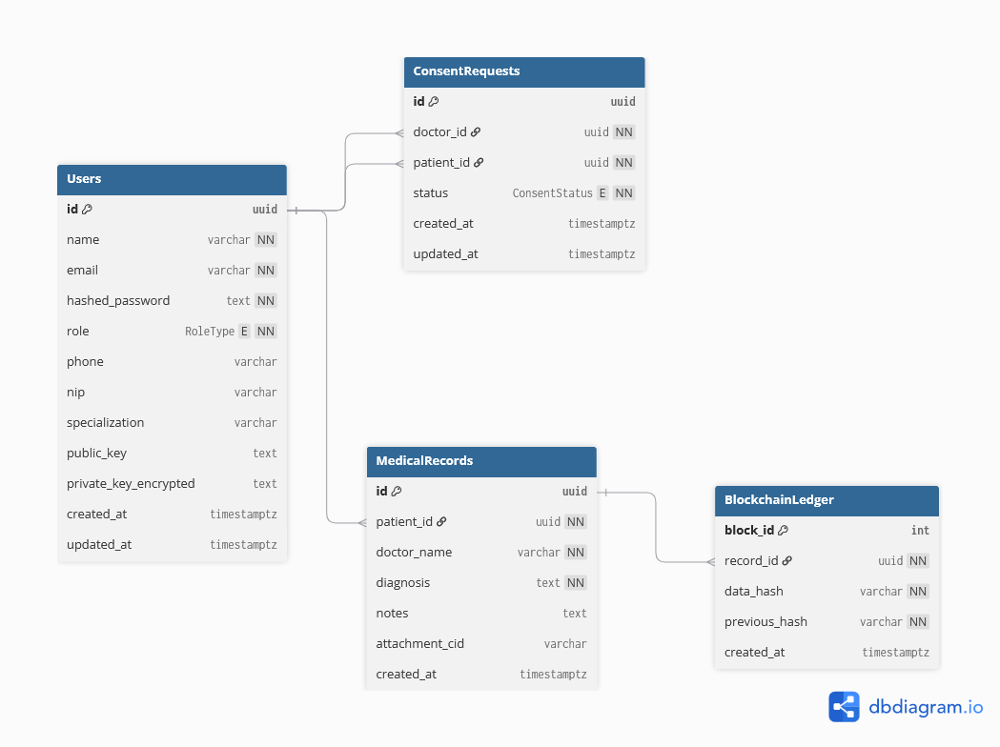

# 🧩 Database Design Documentation — RekamedChain

## 1. Penjelasan Struktur Database yang Digunakan

Struktur basis data **RekamedChain** dirancang untuk mendukung sistem **rekam medis terdesentralisasi** dengan fokus pada keamanan, privasi, dan keterlacakan data pasien.  
Pada tahap **MVP (Minimum Viable Product)**, desain difokuskan pada fungsi utama yaitu:
- Pendaftaran pengguna (dokter & pasien)
- Pembuatan dan penyimpanan rekam medis
- Manajemen izin akses (consent)
- Pencatatan hash data pada *blockchain ledger* internal

Ke depan, struktur akan dikembangkan untuk mendukung lebih banyak peran (admin, perawat), tipe rekam medis (laboratorium, resep, radiologi), dan integrasi fasilitas kesehatan (*faskes*).

---

## 2. Daftar Tabel dan Atribut

### 🧑‍⚕️ Tabel `Users`
| Kolom | Tipe Data | Keterangan |
|-------|------------|------------|
| `id` | `uuid` (PK, default `uuid_generate_v4()`) | ID unik pengguna |
| `name` | `varchar` | Nama pengguna |
| `email` | `varchar` (unique, not null) | Alamat email |
| `hashed_password` | `text` | Password yang di-hash |
| `role` | `RoleType` | Peran pengguna (`patient`, `doctor`) |
| `phone` | `varchar` | Nomor telepon (opsional) |
| `nip` | `varchar` | Nomor Induk Pegawai (jika tenaga medis) |
| `specialization` | `varchar` | Spesialisasi medis |
| `public_key` | `text` | Kunci publik untuk enkripsi data |
| `private_key_encrypted` | `text` | Kunci privat terenkripsi |
| `created_at` | `timestamptz` | Waktu pembuatan data |
| `updated_at` | `timestamptz` | Waktu pembaruan data |

---

### 📄 Tabel `MedicalRecords`
| Kolom | Tipe Data | Keterangan |
|-------|------------|------------|
| `id` | `uuid` (PK) | ID unik rekam medis |
| `patient_id` | `uuid` (FK → `Users.id`) | Pemilik data (pasien) |
| `doctor_name` | `varchar` | Nama dokter pencatat |
| `diagnosis` | `text` | Diagnosis dokter |
| `notes` | `text` | Catatan tambahan |
| `attachment_cid` | `varchar` | Pointer ke file terenkripsi di IPFS/server |
| `created_at` | `timestamptz` | Waktu pembuatan catatan |

---

### 🔑 Tabel `ConsentRequests`
| Kolom | Tipe Data | Keterangan |
|-------|------------|------------|
| `id` | `uuid` (PK) | ID unik permintaan |
| `doctor_id` | `uuid` (FK → `Users.id`) | Dokter yang meminta izin |
| `patient_id` | `uuid` (FK → `Users.id`) | Pasien pemilik data |
| `status` | `ConsentStatus` | Status permintaan (`pending`, `approved`, `rejected`) |
| `created_at` | `timestamptz` | Waktu dibuat |
| `updated_at` | `timestamptz` | Waktu diperbarui |

---

### ⛓️ Tabel `BlockchainLedger`
| Kolom | Tipe Data | Keterangan |
|-------|------------|------------|
| `block_id` | `int` (PK, increment) | Nomor blok |
| `record_id` | `uuid` (FK → `MedicalRecords.id`) | ID rekam medis terkait |
| `data_hash` | `varchar` | Hash dari data rekam medis |
| `previous_hash` | `varchar` | Hash dari blok sebelumnya |
| `created_at` | `timestamptz` | Waktu pencatatan |

---

## 3. Diagram ERD

  
> 

---

## 4. Penjelasan Relasi Antar Tabel

Struktur database RekamedChain MVP terdiri dari empat tabel utama yang saling berhubungan untuk mendukung alur autentikasi pengguna, pengelolaan rekam medis, kontrol izin akses, dan pencatatan hash ke blockchain.

### Relasi Utama

1. **Users ↔ MedicalRecords**
   - Relasi: *One-to-Many*
   - Satu pengguna dengan peran **pasien** dapat memiliki banyak entri rekam medis.
   - Atribut relasi: `MedicalRecords.patient_id → Users.id`

2. **Users ↔ ConsentRequests**
   - Relasi: *Many-to-Many* (melalui dua foreign key)
   - Dokter dapat mengajukan beberapa permintaan izin ke pasien yang berbeda, dan pasien juga dapat menerima beberapa permintaan izin dari berbagai dokter.
   - Atribut relasi:
     - `ConsentRequests.doctor_id → Users.id`
     - `ConsentRequests.patient_id → Users.id`

3. **MedicalRecords ↔ BlockchainLedger**
   - Relasi: *One-to-One*
   - Setiap entri rekam medis memiliki satu catatan terkait di tabel `BlockchainLedger` yang menyimpan hash dari data medis untuk menjamin integritas dan transparansi.
   - Atribut relasi: `BlockchainLedger.record_id → MedicalRecords.id`

4. **Users ↔ BlockchainLedger (secara tidak langsung)**
   - Relasi: *Indirect via MedicalRecords*
   - Pengguna (pasien atau dokter) berkontribusi terhadap catatan yang akhirnya di-hash dan dicatat pada blockchain, memberikan jejak audit atas aktivitas data medis.

---

## 5. Alasan Perancangan

Desain database RekamedChain MVP mengikuti prinsip **kesederhanaan, skalabilitas, dan keamanan**. Beberapa pertimbangan perancangan antara lain:

1. **Pemecahan Peran dalam Tabel `Users`**
   - Alih-alih membuat tabel terpisah untuk dokter dan pasien, MVP hanya menggunakan satu tabel `Users` dengan atribut `role` untuk membedakan peran.  
   - Pendekatan ini mempercepat pengembangan awal dan memudahkan autentikasi terpusat (single user table).

2. **Tabel `MedicalRecords` yang Modular**
   - Tabel ini menyimpan data inti dari setiap rekam medis, seperti diagnosis, catatan tambahan, dan CID file di IPFS.  
   - Penyimpanan `attachment_cid` memungkinkan integrasi dengan sistem terdistribusi tanpa membebani database utama.

3. **`ConsentRequests` sebagai Pengontrol Akses Data**
   - Dengan model izin berbasis permintaan, pasien memiliki kontrol penuh terhadap siapa yang dapat mengakses data medis mereka.  
   - Status `pending`, `approved`, dan `rejected` mendukung alur otorisasi yang eksplisit.

4. **Integrasi Blockchain Melalui `BlockchainLedger`**
   - Pencatatan hash dari data medis di tabel `BlockchainLedger` berfungsi sebagai lapisan audit dan verifikasi integritas.  
   - Desain ini memungkinkan validasi historis tanpa mengungkapkan data medis asli.

5. **Kesiapan untuk Skalabilitas**
   - Struktur ini dirancang agar mudah diperluas di masa depan. Misalnya:
     - Penambahan tabel `Patients` dan `HealthProfessionals` untuk menyimpan data lebih rinci.
     - Penambahan enumerasi `RecordType` untuk mendukung berbagai jenis rekam medis (konsultasi, resep, hasil lab, dll).

6. **Keseimbangan antara MVP dan Visi Produk Akhir**
   - MVP difokuskan pada fungsi inti (akses data medis aman dan transparan), namun tetap kompatibel dengan desain penuh yang telah direncanakan.
   - Hal ini memungkinkan transisi bertahap tanpa perlu migrasi database besar di kemudian hari.