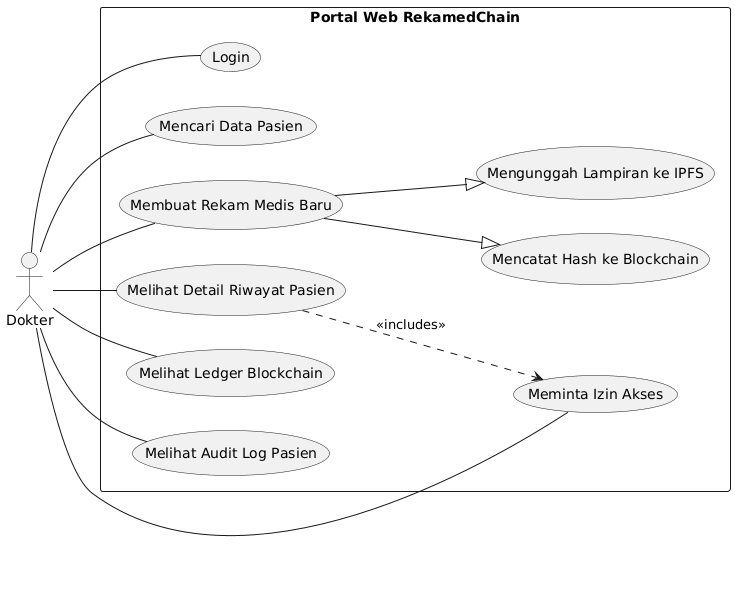

# Use Case Diagram dan Deskripsi: RekamedChain

**Versi Dokumen:** 1.0  
**Tanggal:** 9 Oktober 2025  

Dokumen ini menguraikan aktor-aktor yang terlibat dalam sistem RekamedChain, use case utama mereka, serta deskripsi fungsionalitas untuk setiap use case dalam lingkup MVP dan rencana pengembangan skala penuh.

---

## 1. Daftar Aktor

Sistem RekamedChain memiliki dua aktor utama yang berinteraksi langsung dengan aplikasi:

- **Pasien:** Pengguna utama yang merupakan pemilik data medis. Pasien memiliki kedaulatan penuh untuk mengelola dan memberikan persetujuan akses terhadap data kesehatannya melalui aplikasi mobile.
- **Tenaga Medis (Dokter):** Pengguna profesional yang memiliki wewenang untuk mencatat data medis dan meminta akses ke riwayat medis pasien setelah mendapatkan persetujuan. Dokter berinteraksi dengan sistem melalui portal web.

---

## 2. Diagram Use Case

### 2.1 Diagram Use Case Pasien

  

### 2.2 Diagram Use Case Tenaga Medis (Dokter)

  

---

## 3. & 4. Daftar dan Deskripsi Use Case

### Aktor: Pasien

| Use Case | Deskripsi (Fungsi & Manfaat) | Status | Antarmuka Terkait |
|----------|-------------------------------|--------|------------------|
| Registrasi & Pembuatan Kunci Digital | Pasien membuat akun baru melalui aplikasi mobile. Sistem secara otomatis menghasilkan pasangan kunci kriptografi (publik & privat) yang menjadi dasar identitas digital berdaulat (SSI) pasien. Manfaat: Memberikan pasien alat (kunci privat) untuk mengontrol datanya secara mandiri. | Sudah diimplementasikan (MVP) | - |
| Login | Pasien masuk ke aplikasi menggunakan email dan password untuk mengakses fitur-fitur yang dipersonalisasi. | Sudah diimplementasikan (MVP) | - |
| Melihat Riwayat Medis | Pasien dapat melihat seluruh riwayat medisnya dalam format linimasa yang kronologis dan mudah dibaca, termasuk detail diagnosis, catatan dokter, dan lampiran. Manfaat: Memberikan transparansi dan akses mudah ke data kesehatan pribadi. | Sudah diimplementasikan (MVP) | - |
| Mengelola Izin Akses | Pasien dapat melihat daftar permintaan akses dari tenaga medis, lengkap dengan detail siapa yang meminta dan untuk tujuan apa. Pasien memiliki kontrol penuh untuk menyetujui atau menolak permintaan tersebut. Manfaat: Ini adalah inti dari kedaulatan pasien. | Sudah diimplementasikan (MVP) | - |
| Menyetujui dengan Tanda Tangan Digital | Saat menyetujui permintaan, aplikasi menggunakan kunci privat pasien untuk membuat tanda tangan digital yang unik. Manfaat: Memberikan persetujuan yang terbukti secara kriptografis, aman, dan tidak dapat disangkal. | Sudah diimplementasikan (MVP) | Tombol "Setujui" di halaman Manajemen Izin |
| Melihat Log Akses | Pasien dapat melihat jejak audit transparan dari semua aktivitas yang terjadi pada datanya, seperti kapan izin diminta, disetujui, dan kapan data baru ditambahkan. Manfaat: Meningkatkan transparansi dan kepercayaan. | Sudah diimplementasikan (MVP) | - |

### Aktor: Tenaga Medis (Dokter)

| Use Case | Deskripsi (Fungsi & Manfaat) | Status | Antarmuka Terkait |
|----------|-------------------------------|--------|------------------|
| Login | Dokter masuk ke portal web untuk mengakses fitur-fitur profesional. | Sudah diimplementasikan (MVP) | - |
| Mencari Pasien | Dokter dapat mencari data pasien yang terdaftar di sistem berdasarkan nama atau email untuk memulai proses interaksi medis. | Sudah diimplementasikan (MVP) | Halaman "Pencarian Pasien" di Portal Web |
| Meminta Izin Akses | Dari halaman detail pasien, dokter dapat mengirimkan permintaan untuk mengakses riwayat medis pasien. Permintaan ini akan dikirim ke aplikasi pasien. | Sudah diimplementasikan (MVP) | Tombol "Minta Izin Akses" di halaman Detail Pasien |
| Melihat Detail Riwayat Pasien | Setelah mendapatkan izin, dokter dapat melihat riwayat medis lengkap pasien dalam format linimasa terpadu. Manfaat: Membantu dokter membuat diagnosis yang lebih akurat dan cepat. | Sudah diimplementasikan (MVP) | - |
| Membuat Rekam Medis Baru | Dokter dapat mencatat data medis baru (diagnosis, catatan, lampiran). Data sensitif akan dienkripsi, lampiran disimpan ke IPFS, dan hash-nya dicatat ke blockchain. Manfaat: Memastikan data baru aman, terverifikasi, dan terintegrasi. | Sudah diimplementasikan (MVP) | - |
| Melihat Ledger Blockchain | Dokter dapat melihat "buku besar" blockchain yang berisi daftar hash dari semua rekam medis yang pernah dibuat, sebagai bukti integritas data. | Sudah diimplementasikan (MVP) | Halaman "Lihat Ledger" di Portal Web |
| Melihat Audit Log Pasien | Setelah mendapat izin, dokter dapat melihat jejak audit aktivitas pada data seorang pasien. | Sudah diimplementasikan (MVP) | Halaman "Audit Log" di Portal Web |
| Integrasi SATUSEHAT (Simulasi) | Dokter dapat mensimulasikan penarikan data pasien dari sistem eksternal seperti SATUSEHAT. Manfaat: Membuktikan kapabilitas interoperabilitas sistem RekamedChain. | Direncanakan | Tombol "Tarik Data" di halaman Detail Pasien |
