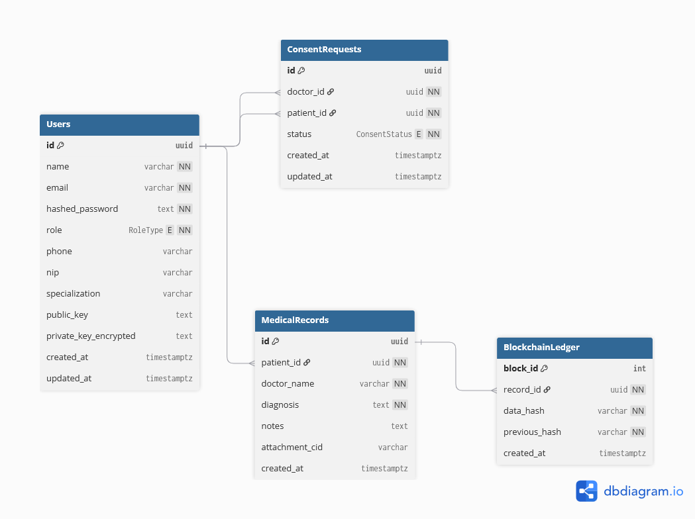
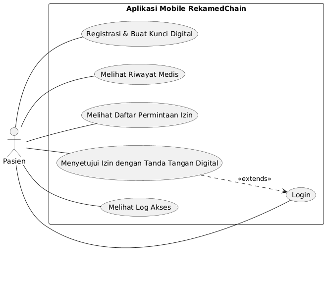
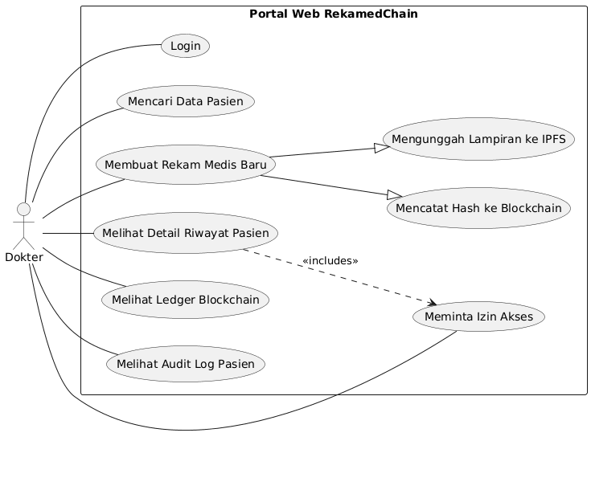

# 🏥 Deskripsi Proyek: RekamedChain

**Versi:** 1.0 (MVP)  
**Tanggal:** 9 Oktober 2025  

---

## 1. Latar Belakang

Sistem kesehatan digital di Indonesia menghadapi tiga tantangan sistemik yang krusial: **fragmentasi data antar fasilitas kesehatan (faskes)**, **kerentanan keamanan siber terhadap data medis yang sensitif**, dan **ketiadaan kedaulatan pasien atas data kesehatan pribadi mereka**.

Meskipun regulasi seperti *Permenkes No. 24 Tahun 2022 tentang Rekam Medis Elektronik (RME)* dan platform **SATUSEHAT** telah mendorong digitalisasi, fondasi teknis yang ada masih berbasis arsitektur **terpusat** yang rapuh. Hal ini menghambat interoperabilitas data, menurunkan kepercayaan publik, dan menempatkan pasien pada posisi yang lemah dalam mengontrol data mereka sendiri.

Proyek **RekamedChain** dikembangkan untuk menjawab tantangan fundamental ini dengan merombak paradigma pengelolaan rekam medis.

---

## 2. Tujuan Pengembangan Aplikasi

Pengembangan RekamedChain bertujuan untuk menghasilkan sebuah **Minimum Viable Product (MVP)** yang fungsional dengan tujuan strategis sebagai berikut:

1. **Membangun Arsitektur Terdesentralisasi**  
   Menciptakan purwarupa sistem rekam medis yang menjamin keamanan, integritas, dan interoperabilitas data dengan memanfaatkan teknologi **blockchain** dan **penyimpanan terdistribusi**.

2. **Mewujudkan Kedaulatan Pasien (Self-Sovereign Identity - SSI)**  
   Mengimplementasikan model SSI untuk memberikan pasien **kontrol penuh** dalam mengelola dan memberikan persetujuan akses terhadap data medis pribadi mereka secara kriptografis.

3. **Membuktikan Kelayakan Konsep (Proof-of-Concept)**  
   Menyediakan bukti konsep yang solid bahwa **arsitektur hibrida (on-chain dan off-chain)** dapat diimplementasikan secara efektif untuk kasus penggunaan rekam medis.

4. **Menyiapkan Fondasi untuk Interoperabilitas Nasional**  
   Membangun fondasi sistem yang dirancang untuk dapat diintegrasikan dengan ekosistem kesehatan nasional seperti **platform SATUSEHAT**.

---

## 3. Solusi yang Ditawarkan

RekamedChain menawarkan solusi inovatif melalui **arsitektur tiga lapis** yang bekerja secara sinergis:

### 🧩 Lapisan Data & Skalabilitas (Off-Chain Storage)
- Data rekam medis aktual (diagnosis, catatan) dienkripsi dengan **AES-256** sebelum disimpan di **PostgreSQL**.  
- File lampiran (hasil lab, radiologi, dll) disimpan secara **terdesentralisasi** di **IPFS**.  
- Pendekatan ini menjamin **kerahasiaan data at-rest** sekaligus menjaga **skalabilitas** sistem.

### 🧠 Lapisan Kedaulatan Pasien (Self-Sovereign Identity - SSI)
- Saat registrasi, setiap pasien dibuatkan **pasangan kunci kriptografi ECDSA** (kunci publik & privat).  
- Kunci privat disimpan aman di perangkat pasien dan digunakan sebagai **tanda tangan digital**.  
- Pasien menggunakan kunci ini untuk menyetujui setiap permintaan akses data, menciptakan **bukti persetujuan yang tak terbantahkan** secara matematis.

### 🔗 Lapisan Konsensus & Integritas (Blockchain)
- Blockchain **tidak menyimpan data medis**, melainkan mencatat **sidik jari digital (hash)** dari transaksi penting.  
- Hash disimpan ke dalam **Smart Contract** di jaringan Ethereum (disimulasikan dengan **Hardhat**).  
- Hasilnya adalah **jejak audit transparan** yang tidak dapat dimanipulasi, menjamin integritas dan kepercayaan.

---

## 4. Target Pengguna

MVP RekamedChain dirancang untuk melayani dua kelompok pengguna utama:

### 👤 Pasien
- Mendaftar dan membuat identitas digital (SSI)
- Melihat riwayat medis pribadi
- Mengelola permintaan izin akses dari tenaga medis
- Melihat log audit akses data mereka

### ⚕️ Tenaga Medis (Dokter)
- Mencari data pasien melalui portal web
- Mengirim permintaan izin akses
- Melihat riwayat medis pasien (setelah izin diberikan)
- Mencatat rekam medis baru dan mengunggah lampiran

---

## 5. Ringkasan Teknologi yang Digunakan

### 💻 Frontend (Aplikasi Pasien)
- **Framework:** React Native (Expo)  
- **Bahasa:** TypeScript  
- **Navigasi:** Expo Router (Tab & Stack Navigation)  
- **Styling:** React Native StyleSheet  
- **Kriptografi:** Ethers.js (pembuatan tanda tangan digital)

### 🧭 Frontend (Portal Dokter)
- **Framework:** Next.js (App Router)  
- **Bahasa:** TypeScript  
- **Styling:** Tailwind CSS  
- **UI Components:** Shadcn/ui  

### ⚙️ Backend
- **Bahasa:** Go (Golang)  
- **Framework:** net/http (standard library)  
- **Routing:** ServeMux (awalnya gorilla/mux)  
- **Database Driver:** pgx (PostgreSQL)  
- **Blockchain Interaction:** go-ethereum (Geth)  
- **Autentikasi:** jwt-go  
- **CORS Handling:** rs/cors  

### 🗄️ Database & Penyimpanan
- **Database Utama:** PostgreSQL (Dockerized)  
- **Penyimpanan File:** IPFS (Kubo, Dockerized)

### ⛓️ Blockchain
- **Jaringan Lokal:** Hardhat (Node Ethereum lokal)  
- **Bahasa Smart Contract:** Solidity  

### 🧰 Infrastruktur & DevOps
- **Containerization:** Docker & Docker Compose  
- **CI/CD:** GitHub Actions  
- **Development Tunneling:** Ngrok  

---

## 6. Kesimpulan Singkat

Proyek **RekamedChain** berhasil mengembangkan sebuah **Minimum Viable Product (MVP)** yang membuktikan kelayakan konsep rekam medis berbasis blockchain dan SSI.

Melalui arsitektur tiga lapis yang solid, aplikasi ini menunjukkan bahwa:
- Teknologi **blockchain** dapat menjamin integritas data medis,  
- **SSI** mampu memberi pasien kendali penuh atas data mereka, dan  
- **Penyimpanan terdesentralisasi** dapat menjaga keamanan sekaligus efisiensi sistem.

Walau masih tahap awal, fondasi teknis dan arsitektur yang dibangun **sudah sangat kokoh** untuk dikembangkan menjadi **pilot project skala penuh** di masa mendatang.

---

> 📘 *Dokumen ini merupakan bagian dari paket dokumentasi MVP RekamedChain (v1.0) — Deskripsi Proyek.*
# 📱 Dokumentasi Fitur dan Implementasi: RekamedChain

**Versi Dokumen:** 1.0  
**Tanggal:** 9 Oktober 2025  

Dokumen ini merincikan daftar fitur utama yang telah dikembangkan untuk Minimum Viable Product (MVP) dari sistem **RekamedChain**, beserta status implementasi dan deskripsi antarmuka terkait.

---

## 1. Autentikasi & Manajemen Peran

Fondasi sistem yang mengatur identitas, akses, dan hak pengguna.

| **Fitur** | **Deskripsi** | **Status** | **Antarmuka Terkait** |
|------------|----------------|-------------|-------------------------|
| **1.1. Registrasi Pengguna** | Pengguna dapat membuat akun baru. Sistem secara otomatis membuat identitas digital dan membedakan peran antara *patient* (via aplikasi mobile) dan *doctor* (via portal web). | ✅ Sudah diimplementasikan | Halaman *Daftar Akun Baru* di Aplikasi Mobile & Portal Web. |
| **1.2. Login Pengguna** | Pengguna dapat masuk ke sistem menggunakan kredensial (email dan password). Sistem memanfaatkan JSON Web Token (JWT) untuk manajemen sesi yang aman. | ✅ Sudah diimplementasikan | Halaman *Login* di Aplikasi Mobile & Portal Web. |
| **1.3. Kontrol Akses Berbasis Peran** | Sistem membedakan hak akses. Fitur kritis seperti pencatatan rekam medis hanya dapat diakses oleh pengguna dengan peran *doctor*. | ✅ Sudah diimplementasikan | Terimplementasi di backend (*middleware*) dan logika UI. |

📸 **Screenshot (dummy):**

---

## 2. Alur Rekam Medis & Data

Fitur inti yang berkaitan dengan pengelolaan dan visualisasi data kesehatan.

| **Fitur** | **Deskripsi** | **Status** | **Antarmuka Terkait** |
|------------|----------------|-------------|-------------------------|
| **2.1. Pembuatan Rekam Medis** | Tenaga medis (*doctor*) dapat membuat catatan rekam medis baru untuk pasien, mencakup diagnosis dan observasi. | ✅ Sudah diimplementasikan | Form *Tambah Rekam Medis Baru* di Portal Web. |
| **2.2. Penyimpanan Lampiran (IPFS)** | File lampiran (misal hasil lab) diunggah ke jaringan IPFS. Alamat unik file (CID) disimpan di database. | ✅ Sudah diimplementasikan | Input file di form *Tambah Rekam Medis* dan link *Lihat Lampiran*. |
| **2.3. Visualisasi Riwayat Medis** | Pasien dan Dokter (dengan izin) dapat melihat riwayat rekam medis secara kronologis. | ✅ Sudah diimplementasikan | Tab *Riwayat Medis* di Aplikasi Mobile dan halaman *Detail Pasien* di Portal Web. |

📸 **Screenshot (dummy):**

---

## 3. Kedaulatan Pasien & Keamanan Data

Fitur inovatif yang menjadi pilar utama RekamedChain.

| **Fitur** | **Deskripsi** | **Status** | **Antarmuka Terkait** |
|------------|----------------|-------------|-------------------------|
| **3.1. Fondasi Self-Sovereign Identity (SSI)** | Saat registrasi, setiap pasien dibuatkan pasangan kunci publik & privat (ECDSA). Kunci privat disimpan aman di perangkat pasien. | ✅ Sudah diimplementasikan | Proses otomatis di backend, penyimpanan kunci di AsyncStorage. |
| **3.2. Manajemen Izin Akses (Consent)** | Pasien dapat menyetujui/menolak permintaan akses data dari dokter. Validasi menggunakan tanda tangan digital pasien. | ✅ Sudah diimplementasikan | Tab *Manajemen Izin* di Aplikasi Mobile. |
| **3.3. Enkripsi Data At-Rest (AES)** | Data rekam medis dienkripsi AES-256 sebelum disimpan di database untuk menjaga kerahasiaan. | ✅ Sudah diimplementasikan | Proses transparan di backend. |

📸 **Screenshot (dummy):**

---

## 4. Transparansi & Jejak Audit

Menjamin aktivitas sistem dapat diverifikasi dengan transparan.

| **Fitur** | **Deskripsi** | **Status** | **Antarmuka Terkait** |
|------------|----------------|-------------|-------------------------|
| **4.1. Pencatatan ke Blockchain (Simulasi)** | Setiap pembuatan rekam medis mencatat *hash* ke Smart Contract di jaringan Ethereum lokal (Hardhat). | ✅ Sudah diimplementasikan | Halaman *Lihat Ledger* di Portal Web. |
| **4.2. Log Akses untuk Pasien** | Pasien dapat melihat aktivitas akses terhadap data medis mereka (permintaan, persetujuan, pencatatan baru). | ✅ Sudah diimplementasikan | Tab *Log Akses* di Aplikasi Mobile. |

📸 **Screenshot (dummy):**

---

## 5. Fitur yang Direncanakan (Menuju Skala Penuh)

Langkah-langkah strategis untuk melengkapi MVP dan mempersiapkan pilot project.

| **Fitur** | **Deskripsi** | **Status** | **Antarmuka Terkait** |
|------------|----------------|-------------|-------------------------|
| **5.1. Bukti Konsep Integrasi** | Implementasi mock API untuk simulasi integrasi eksternal (SATUSEHAT). | 🔄 Direncanakan | Tombol *Tarik Data* di halaman *Detail Pasien*. |
| **5.2. Login Tanpa Password (SSI Penuh)** | Login sepenuhnya berbasis tanda tangan digital pasien. | 🔄 Direncanakan | Alur login baru di Aplikasi Mobile & Portal Web. |
| **5.3. Notifikasi Real-time** | Sistem push notification untuk permintaan izin akses baru. | 🔄 Direncanakan | Fitur notifikasi di Aplikasi Mobile. |
| **5.4. Refactoring Arsitektur Backend** | Pemecahan `main.go` ke package terstruktur (api, storage, domain, dll.) untuk skalabilitas. | 🔄 Direncanakan | Perubahan struktur folder backend. |

📸 **Screenshot (dummy):**

---

## 🧩 Kesimpulan

Seluruh fitur utama yang direncanakan untuk MVP telah berhasil diimplementasikan dan terintegrasi dengan baik antara komponen frontend (React Native & Next.js), backend (Golang), serta blockchain (Hardhat + Solidity).  
Dokumentasi ini menjadi dasar bagi pengembangan tahap berikutnya — menuju versi **pilot project skala penuh** yang siap diujicobakan pada lingkungan kesehatan nyata.

---
# Arsitektur Sistem: RekamedChain

**Versi Dokumen:** 1.0  
**Tanggal:** 9 Oktober 2025  

Dokumen ini memberikan gambaran umum mengenai arsitektur teknis dari sistem **RekamedChain**, menjelaskan alur kerja, komponen utama, dan teknologi yang digunakan dalam implementasi **Minimum Viable Product (MVP)**.

---

## 1. Penjelasan Singkat Alur Sistem

Arsitektur RekamedChain dirancang sebagai sistem multi-lapis yang memisahkan antarmuka pengguna, logika bisnis, dan lapisan data.  
Alur sistem secara umum adalah sebagai berikut:

1. **Interaksi Pengguna**  
   Pengguna (Pasien atau Dokter) berinteraksi melalui aplikasi antarmuka sesuai perannya:  
   - **Aplikasi Mobile (React Native)** untuk Pasien  
   - **Portal Web (Next.js)** untuk Dokter

2. **Permintaan ke Backend**  
   Setiap aksi pengguna diterjemahkan menjadi permintaan HTTPS ke **Backend API Gateway (Go)**.

3. **Proses di Backend**  
   Backend API memproses permintaan: validasi, otentikasi (JWT), otorisasi (role-based), enkripsi/dekripsi data, dan interaksi dengan database.

4. **Interaksi dengan Lapisan Data**  
   Backend berkomunikasi dengan tiga komponen penyimpanan:
   - **PostgreSQL:** menyimpan data terstruktur seperti profil dan metadata rekam medis  
   - **IPFS:** menyimpan file biner (lampiran medis)  
   - **Blockchain (Hardhat):** mencatat hash transaksi sebagai jejak audit yang kekal (immutable)

5. **Respon ke Frontend**  
   Hasil pemrosesan dikirim kembali ke frontend untuk ditampilkan kepada pengguna.

---

## 2. Daftar Teknologi dan Framework

Berikut rincian **tech stack** yang digunakan dalam proyek RekamedChain:

### 🔹 Frontend (Aplikasi Pasien)
- **Framework:** React Native (Expo)
- **Bahasa:** TypeScript
- **Navigasi:** Expo Router
- **Kriptografi:** Ethers.js
- **Penyimpanan Lokal:** AsyncStorage

### 🔹 Frontend (Portal Dokter)
- **Framework:** Next.js (App Router)
- **Bahasa:** TypeScript
- **Styling:** Tailwind CSS
- **Komponen UI:** Shadcn/ui

### 🔹 Backend
- **Bahasa:** Go (Golang)
- **Framework:** net/http (Standard Library)
- **Dependensi Kunci:**  
  - `pgx` → PostgreSQL  
  - `go-ethereum` → Interaksi Blockchain  
  - `jwt-go` → Autentikasi  
  - `rs/cors` → CORS Handling

### 🔹 Database & Penyimpanan
- **Database Utama:** PostgreSQL  
- **Penyimpanan File:** InterPlanetary File System (IPFS / Kubo)

### 🔹 Blockchain
- **Jaringan Development:** Hardhat (Node Ethereum lokal)
- **Bahasa Smart Contract:** Solidity

### 🔹 Infrastruktur & DevOps
- **Containerization:** Docker & Docker Compose  
- **Tunneling (Development):** Ngrok

---

## 3. Diagram Arsitektur Sistem

Diagram berikut mengilustrasikan komponen-komponen utama dan alur interaksi sistem:

---

## 4. Penjelasan Hubungan Antar Komponen

### 🔸 Frontend → Backend
Seluruh interaksi (login, unggah, permintaan data) dari frontend diarahkan ke **Backend API Gateway**.  
Untuk versi pengembangan mobile, koneksi dijembatani melalui **Ngrok**.

### 🔸 Backend → PostgreSQL
Menggunakan **driver pgx** untuk operasi CRUD terhadap data terstruktur: profil pengguna, metadata rekam medis, status izin, dsb.

### 🔸 Backend → IPFS
- **Upload:** Dokter mengunggah file → backend kirim ke IPFS API (port 5001) → dapat CID.  
- **Download/View:** Permintaan ke `/ipfs/<CID>` diteruskan via reverse proxy ke IPFS Gateway (port 8080 internal).

### 🔸 Backend → Hardhat
Saat server dijalankan:
- Backend menginisialisasi koneksi ke **node Hardhat (port 8545)**  
- Deploy **smart contract Ledger.sol**
- Setiap pembuatan rekam medis baru → kirim transaksi ke blockchain → catat hash data.

---

## 5. Ringkasan Keamanan dan Otentikasi

Keamanan merupakan pilar utama sistem RekamedChain.

### 🛡️ Autentikasi Sesi
Menggunakan **JWT (JSON Web Token)**.  
Token dikirim di header `Authorization` untuk setiap request yang dilindungi.

### 🧩 Otorisasi Berbasis Peran (RBAC)
Middleware backend memeriksa `role` dalam JWT (`patient` / `doctor`).  
Endpoint tertentu seperti `POST /records` hanya dapat diakses oleh dokter.

### 🔐 Self-Sovereign Identity (SSI)
Persetujuan akses data (consent) divalidasi menggunakan **tanda tangan digital (ECDSA)**.  
Pasien menandatangani permintaan dengan `private_key` di perangkat; backend memverifikasi dengan `public_key` di database.

### 🧠 Enkripsi Data At-Rest
Data medis sensitif (diagnosis, notes) dienkripsi menggunakan **AES-256** sebelum disimpan di PostgreSQL.

### ⛓️ Integritas Data
Setiap penambahan rekam medis menghasilkan hash yang dicatat di **blockchain lokal (Hardhat)**.  
Hal ini menjamin **audit trail** yang immutable dan transparan.

---

**© Trifur Labs, 2025**
# 🧩 Database Design Documentation — RekamedChain

## 1. Penjelasan Struktur Database yang Digunakan

Struktur basis data **RekamedChain** dirancang untuk mendukung sistem **rekam medis terdesentralisasi** dengan fokus pada keamanan, privasi, dan keterlacakan data pasien.  
Pada tahap **MVP (Minimum Viable Product)**, desain difokuskan pada fungsi utama yaitu:
- Pendaftaran pengguna (dokter & pasien)
- Pembuatan dan penyimpanan rekam medis
- Manajemen izin akses (consent)
- Pencatatan hash data pada *blockchain ledger* internal

Ke depan, struktur akan dikembangkan untuk mendukung lebih banyak peran (admin, perawat), tipe rekam medis (laboratorium, resep, radiologi), dan integrasi fasilitas kesehatan (*faskes*).

---

## 2. Daftar Tabel dan Atribut

### 🧑‍⚕️ Tabel `Users`
| Kolom | Tipe Data | Keterangan |
|-------|------------|------------|
| `id` | `uuid` (PK, default `uuid_generate_v4()`) | ID unik pengguna |
| `name` | `varchar` | Nama pengguna |
| `email` | `varchar` (unique, not null) | Alamat email |
| `hashed_password` | `text` | Password yang di-hash |
| `role` | `RoleType` | Peran pengguna (`patient`, `doctor`) |
| `phone` | `varchar` | Nomor telepon (opsional) |
| `nip` | `varchar` | Nomor Induk Pegawai (jika tenaga medis) |
| `specialization` | `varchar` | Spesialisasi medis |
| `public_key` | `text` | Kunci publik untuk enkripsi data |
| `private_key_encrypted` | `text` | Kunci privat terenkripsi |
| `created_at` | `timestamptz` | Waktu pembuatan data |
| `updated_at` | `timestamptz` | Waktu pembaruan data |

---

### 📄 Tabel `MedicalRecords`
| Kolom | Tipe Data | Keterangan |
|-------|------------|------------|
| `id` | `uuid` (PK) | ID unik rekam medis |
| `patient_id` | `uuid` (FK → `Users.id`) | Pemilik data (pasien) |
| `doctor_name` | `varchar` | Nama dokter pencatat |
| `diagnosis` | `text` | Diagnosis dokter |
| `notes` | `text` | Catatan tambahan |
| `attachment_cid` | `varchar` | Pointer ke file terenkripsi di IPFS/server |
| `created_at` | `timestamptz` | Waktu pembuatan catatan |

---

### 🔑 Tabel `ConsentRequests`
| Kolom | Tipe Data | Keterangan |
|-------|------------|------------|
| `id` | `uuid` (PK) | ID unik permintaan |
| `doctor_id` | `uuid` (FK → `Users.id`) | Dokter yang meminta izin |
| `patient_id` | `uuid` (FK → `Users.id`) | Pasien pemilik data |
| `status` | `ConsentStatus` | Status permintaan (`pending`, `approved`, `rejected`) |
| `created_at` | `timestamptz` | Waktu dibuat |
| `updated_at` | `timestamptz` | Waktu diperbarui |

---

### ⛓️ Tabel `BlockchainLedger`
| Kolom | Tipe Data | Keterangan |
|-------|------------|------------|
| `block_id` | `int` (PK, increment) | Nomor blok |
| `record_id` | `uuid` (FK → `MedicalRecords.id`) | ID rekam medis terkait |
| `data_hash` | `varchar` | Hash dari data rekam medis |
| `previous_hash` | `varchar` | Hash dari blok sebelumnya |
| `created_at` | `timestamptz` | Waktu pencatatan |

---

## 3. Diagram ERD

  
> 

---

## 4. Penjelasan Relasi Antar Tabel

Struktur database RekamedChain MVP terdiri dari empat tabel utama yang saling berhubungan untuk mendukung alur autentikasi pengguna, pengelolaan rekam medis, kontrol izin akses, dan pencatatan hash ke blockchain.

### Relasi Utama

1. **Users ↔ MedicalRecords**
   - Relasi: *One-to-Many*
   - Satu pengguna dengan peran **pasien** dapat memiliki banyak entri rekam medis.
   - Atribut relasi: `MedicalRecords.patient_id → Users.id`

2. **Users ↔ ConsentRequests**
   - Relasi: *Many-to-Many* (melalui dua foreign key)
   - Dokter dapat mengajukan beberapa permintaan izin ke pasien yang berbeda, dan pasien juga dapat menerima beberapa permintaan izin dari berbagai dokter.
   - Atribut relasi:
     - `ConsentRequests.doctor_id → Users.id`
     - `ConsentRequests.patient_id → Users.id`

3. **MedicalRecords ↔ BlockchainLedger**
   - Relasi: *One-to-One*
   - Setiap entri rekam medis memiliki satu catatan terkait di tabel `BlockchainLedger` yang menyimpan hash dari data medis untuk menjamin integritas dan transparansi.
   - Atribut relasi: `BlockchainLedger.record_id → MedicalRecords.id`

4. **Users ↔ BlockchainLedger (secara tidak langsung)**
   - Relasi: *Indirect via MedicalRecords*
   - Pengguna (pasien atau dokter) berkontribusi terhadap catatan yang akhirnya di-hash dan dicatat pada blockchain, memberikan jejak audit atas aktivitas data medis.

---

## 5. Alasan Perancangan

Desain database RekamedChain MVP mengikuti prinsip **kesederhanaan, skalabilitas, dan keamanan**. Beberapa pertimbangan perancangan antara lain:

1. **Pemecahan Peran dalam Tabel `Users`**
   - Alih-alih membuat tabel terpisah untuk dokter dan pasien, MVP hanya menggunakan satu tabel `Users` dengan atribut `role` untuk membedakan peran.  
   - Pendekatan ini mempercepat pengembangan awal dan memudahkan autentikasi terpusat (single user table).

2. **Tabel `MedicalRecords` yang Modular**
   - Tabel ini menyimpan data inti dari setiap rekam medis, seperti diagnosis, catatan tambahan, dan CID file di IPFS.  
   - Penyimpanan `attachment_cid` memungkinkan integrasi dengan sistem terdistribusi tanpa membebani database utama.

3. **`ConsentRequests` sebagai Pengontrol Akses Data**
   - Dengan model izin berbasis permintaan, pasien memiliki kontrol penuh terhadap siapa yang dapat mengakses data medis mereka.  
   - Status `pending`, `approved`, dan `rejected` mendukung alur otorisasi yang eksplisit.

4. **Integrasi Blockchain Melalui `BlockchainLedger`**
   - Pencatatan hash dari data medis di tabel `BlockchainLedger` berfungsi sebagai lapisan audit dan verifikasi integritas.  
   - Desain ini memungkinkan validasi historis tanpa mengungkapkan data medis asli.

5. **Kesiapan untuk Skalabilitas**
   - Struktur ini dirancang agar mudah diperluas di masa depan. Misalnya:
     - Penambahan tabel `Patients` dan `HealthProfessionals` untuk menyimpan data lebih rinci.
     - Penambahan enumerasi `RecordType` untuk mendukung berbagai jenis rekam medis (konsultasi, resep, hasil lab, dll).

6. **Keseimbangan antara MVP dan Visi Produk Akhir**
   - MVP difokuskan pada fungsi inti (akses data medis aman dan transparan), namun tetap kompatibel dengan desain penuh yang telah direncanakan.
   - Hal ini memungkinkan transisi bertahap tanpa perlu migrasi database besar di kemudian hari.
# Use Case Diagram dan Deskripsi: RekamedChain

**Versi Dokumen:** 1.0  
**Tanggal:** 9 Oktober 2025  

Dokumen ini menguraikan aktor-aktor yang terlibat dalam sistem RekamedChain, use case utama mereka, serta deskripsi fungsionalitas untuk setiap use case dalam lingkup MVP dan rencana pengembangan skala penuh.

---

## 1. Daftar Aktor

Sistem RekamedChain memiliki dua aktor utama yang berinteraksi langsung dengan aplikasi:

- **Pasien:** Pengguna utama yang merupakan pemilik data medis. Pasien memiliki kedaulatan penuh untuk mengelola dan memberikan persetujuan akses terhadap data kesehatannya melalui aplikasi mobile.
- **Tenaga Medis (Dokter):** Pengguna profesional yang memiliki wewenang untuk mencatat data medis dan meminta akses ke riwayat medis pasien setelah mendapatkan persetujuan. Dokter berinteraksi dengan sistem melalui portal web.

---

## 2. Diagram Use Case

### 2.1 Diagram Use Case Pasien

  

### 2.2 Diagram Use Case Tenaga Medis (Dokter)

  

---

## 3. & 4. Daftar dan Deskripsi Use Case

### Aktor: Pasien

| Use Case | Deskripsi (Fungsi & Manfaat) | Status | Antarmuka Terkait |
|----------|-------------------------------|--------|------------------|
| Registrasi & Pembuatan Kunci Digital | Pasien membuat akun baru melalui aplikasi mobile. Sistem secara otomatis menghasilkan pasangan kunci kriptografi (publik & privat) yang menjadi dasar identitas digital berdaulat (SSI) pasien. Manfaat: Memberikan pasien alat (kunci privat) untuk mengontrol datanya secara mandiri. | Sudah diimplementasikan (MVP) | - |
| Login | Pasien masuk ke aplikasi menggunakan email dan password untuk mengakses fitur-fitur yang dipersonalisasi. | Sudah diimplementasikan (MVP) | - |
| Melihat Riwayat Medis | Pasien dapat melihat seluruh riwayat medisnya dalam format linimasa yang kronologis dan mudah dibaca, termasuk detail diagnosis, catatan dokter, dan lampiran. Manfaat: Memberikan transparansi dan akses mudah ke data kesehatan pribadi. | Sudah diimplementasikan (MVP) | - |
| Mengelola Izin Akses | Pasien dapat melihat daftar permintaan akses dari tenaga medis, lengkap dengan detail siapa yang meminta dan untuk tujuan apa. Pasien memiliki kontrol penuh untuk menyetujui atau menolak permintaan tersebut. Manfaat: Ini adalah inti dari kedaulatan pasien. | Sudah diimplementasikan (MVP) | - |
| Menyetujui dengan Tanda Tangan Digital | Saat menyetujui permintaan, aplikasi menggunakan kunci privat pasien untuk membuat tanda tangan digital yang unik. Manfaat: Memberikan persetujuan yang terbukti secara kriptografis, aman, dan tidak dapat disangkal. | Sudah diimplementasikan (MVP) | Tombol "Setujui" di halaman Manajemen Izin |
| Melihat Log Akses | Pasien dapat melihat jejak audit transparan dari semua aktivitas yang terjadi pada datanya, seperti kapan izin diminta, disetujui, dan kapan data baru ditambahkan. Manfaat: Meningkatkan transparansi dan kepercayaan. | Sudah diimplementasikan (MVP) | - |

### Aktor: Tenaga Medis (Dokter)

| Use Case | Deskripsi (Fungsi & Manfaat) | Status | Antarmuka Terkait |
|----------|-------------------------------|--------|------------------|
| Login | Dokter masuk ke portal web untuk mengakses fitur-fitur profesional. | Sudah diimplementasikan (MVP) | - |
| Mencari Pasien | Dokter dapat mencari data pasien yang terdaftar di sistem berdasarkan nama atau email untuk memulai proses interaksi medis. | Sudah diimplementasikan (MVP) | Halaman "Pencarian Pasien" di Portal Web |
| Meminta Izin Akses | Dari halaman detail pasien, dokter dapat mengirimkan permintaan untuk mengakses riwayat medis pasien. Permintaan ini akan dikirim ke aplikasi pasien. | Sudah diimplementasikan (MVP) | Tombol "Minta Izin Akses" di halaman Detail Pasien |
| Melihat Detail Riwayat Pasien | Setelah mendapatkan izin, dokter dapat melihat riwayat medis lengkap pasien dalam format linimasa terpadu. Manfaat: Membantu dokter membuat diagnosis yang lebih akurat dan cepat. | Sudah diimplementasikan (MVP) | - |
| Membuat Rekam Medis Baru | Dokter dapat mencatat data medis baru (diagnosis, catatan, lampiran). Data sensitif akan dienkripsi, lampiran disimpan ke IPFS, dan hash-nya dicatat ke blockchain. Manfaat: Memastikan data baru aman, terverifikasi, dan terintegrasi. | Sudah diimplementasikan (MVP) | - |
| Melihat Ledger Blockchain | Dokter dapat melihat "buku besar" blockchain yang berisi daftar hash dari semua rekam medis yang pernah dibuat, sebagai bukti integritas data. | Sudah diimplementasikan (MVP) | Halaman "Lihat Ledger" di Portal Web |
| Melihat Audit Log Pasien | Setelah mendapat izin, dokter dapat melihat jejak audit aktivitas pada data seorang pasien. | Sudah diimplementasikan (MVP) | Halaman "Audit Log" di Portal Web |
| Integrasi SATUSEHAT (Simulasi) | Dokter dapat mensimulasikan penarikan data pasien dari sistem eksternal seperti SATUSEHAT. Manfaat: Membuktikan kapabilitas interoperabilitas sistem RekamedChain. | Direncanakan | Tombol "Tarik Data" di halaman Detail Pasien |
# Desain UI/UX: RekamedChain

**Versi Dokumen:** 1.0  
**Tanggal:** 9 Oktober 2025  

Dokumen ini menguraikan prinsip-prinsip desain, gaya visual, dan alur pengalaman pengguna (UX) yang menjadi landasan bagi pengembangan antarmuka (UI) aplikasi RekamedChain.

---

## 1. Makna Logo

Logo RekamedChain adalah fondasi dari identitas visual dan filosofi proyek. Setiap elemen dirancang untuk menceritakan sebuah narasi:

- **Bentuk Hati:** Melambangkan pilar utama yaitu kesehatan, kepedulian, dan fokus pada kemanusiaan (pasien).  
- **Jalinan di Dalam Hati:** Merepresentasikan tiga konsep inti:  
  - **Rantai (Chain):** Simbol dari keamanan dan integritas yang dibawa oleh teknologi Blockchain.  
  - **Integrasi:** Visualisasi dari solusi atas masalah data yang terfragmentasi, di mana RekamedChain menyatukan riwayat medis dari berbagai faskes.  
  - **Hubungan Kepercayaan:** Menggambarkan hubungan berbasis persetujuan (consent) antara pasien dan tenaga medis.  
- **Garis Kontinu:** Melambangkan kesinambungan perawatan (continuity of care), di mana data pasien mengalir utuh dan tanpa putus sepanjang hidup mereka.  
- **Gradasi Warna (Hijau ke Biru):** Menunjukkan sinergi yang harmonis antara dunia kesehatan (hijau) dan teknologi/kepercayaan (biru).  

> Secara keseluruhan, logo ini bermakna: "Sebuah sistem yang berpusat pada kepedulian terhadap pasien (hati), dengan mengintegrasikan teknologi blockchain yang aman (jalinan rantai) untuk menciptakan alur riwayat medis yang berkelanjutan (garis kontinu)."

---

## 2. Prinsip Desain dan Gaya Visual

Desain RekamedChain dibangun di atas tiga pilar utama: **Kepercayaan, Kejelasan, dan Kedaulatan.**

- **Palet Warna Utama:**  
  - **Biru Utama (#007AFF):** Kepercayaan, teknologi, stabilitas. Digunakan untuk aksi primer (tombol utama, tautan, ikon aktif).  
  - **Hijau Sekunder (#34D399):** Kesehatan, persetujuan, status "Aktif". Digunakan untuk badge status positif.  
  - **Merah Aksen (#EF4444):** Peringatan, penolakan, aksi "Cabut". Digunakan terbatas untuk menarik perhatian tindakan penting.  
  - **Netral:** Abu-abu (#f0f4f8 untuk latar) & putih (#ffffff untuk kartu) untuk tampilan bersih, minimalis, fokus konten.  

- **Tipografi:**  
  Menggunakan font sans-serif modern & mudah dibaca (System UI di mobile, Inter di web).  

- **Gaya Ikon:**  
  Library **Feather Icons**: outline, modern, minimalis, selaras dengan prinsip desain fungsional.

---

## 3. Alur Navigasi (Flow)

- **Alur Pasien (Aplikasi Mobile):**  
  1. Buka Aplikasi → diarahkan ke Login  
  2. Login/Register → Pengguna membuat akun (menyimpan private key)  
  3. Dasbor Utama (Tab Navigator: Dasbor, Riwayat, Izin Akses, Log Akses)  
  4. Logout → Tombol di halaman profil (fitur direncanakan)  

- **Alur Tenaga Medis (Portal Web):**  
  1. Buka Portal → diarahkan ke Login  
  2. Login → Dokter masuk ke sistem  
  3. Navigasi via Navbar → Pencarian Pasien, Ledger Blockchain, Logout  
  4. Alur Inti: Pencarian Pasien → Detail Pasien → Meminta Izin / Melihat Audit Log / Menambah Rekam Medis Baru

---

## 4. Deskripsi Halaman Utama dan Komponennya

### **Aplikasi Mobile (Pasien)**

- **Halaman Login & Registrasi:** Layout berbasis kartu, logo, input dengan ikon, show/hide password, modal animasi Lottie untuk feedback.  
- **Halaman Dasbor:** Header profil, kartu notifikasi "Permintaan Akses Baru", kartu "Ringkasan Kesehatan", kartu aksi navigasi.  
- **Halaman Riwayat, Izin, Log Akses:** Layout linimasa atau SectionList, data kronologis, badge warna untuk status.

### **Portal Web (Dokter)**

- **Layout Utama:** Navbar persisten untuk navigasi konsisten  
- **Halaman Pencarian & Detail:** Layout kartu, informasi kondisional berdasarkan status izin  
- **Komponen:** Menggunakan **shadcn/ui** untuk konsistensi dan aksesibilitas

---

## 5. Screenshot / Wireframe (Dummy)

### Aplikasi Mobile (Pasien)
  
  
  

### Portal Web (Dokter)
  
  

---

## 6. Bagaimana UI Mendukung UX

Desain UI RekamedChain mendukung pengalaman pengguna (UX) dengan menerapkan prinsip heuristik Jakob Nielsen:

- **Visibility of System Status:** Feedback loading, error jelas, modal animasi Lottie untuk status sukses/gagal.  
- **User Control and Freedom:** Show/hide password, tombol kembali, tombol "Cabut Izin" → kendali penuh pengguna.  
- **Consistency and Standards:** Tab navigator di mobile & navbar di web konsisten, ikonografi standar → mengurangi beban kognitif.  
- **Aesthetic and Minimalist Design:** Layout bersih, fokus konten, penggunaan whitespace & kartu memudahkan pencarian informasi.  
- **Branding & Logo:** Memperkuat identitas aplikasi dan meningkatkan kepercayaan pengguna.
# Rencana Pengembangan: RekamedChain

**Versi Dokumen:** 1.0  
**Tanggal:** 9 Oktober 2025  

Dokumen ini bertujuan untuk mengevaluasi status Minimum Viable Product (MVP) RekamedChain saat ini, mengidentifikasi pencapaian dan kendala, serta merumuskan roadmap pengembangan strategis untuk evolusi produk menuju skala penuh yang siap untuk pilot project.

---

## 1. Evaluasi Versi MVP

Versi MVP saat ini telah membuktikan kelayakan teknis dari konsep inti proyek. Alur kerja utama, dari pembuatan identitas digital pasien hingga pencatatan data medis yang diamankan oleh simulasi blockchain, telah berhasil diimplementasikan.

### **Kelebihan & Pencapaian Utama**
- **Validasi Konsep:** Arsitektur tiga lapis—penyimpanan off-chain (PostgreSQL & IPFS), lapisan kedaulatan pasien (SSI), dan lapisan integritas (blockchain ledger)—telah terbukti dapat diimplementasikan secara sinergis.
- **Prototipe Fungsional:** Dua antarmuka utama (Aplikasi Pasien Mobile & Portal Tenaga Medis Web) dibangun dengan alur fitur esensial yang berfungsi penuh.
- **Alur Pengguna Lengkap:**  
  Registrasi Pasien (SSI) → Login → Permintaan Izin oleh Dokter → Persetujuan Izin oleh Pasien (tanda tangan digital) → Dokter Melihat & Menambah Rekam Medis → Data Baru Tercatat di Blockchain Ledger.
- **Fondasi Teknologi Solid:** Infrastruktur berbasis Docker → lingkungan konsisten, portabel, mudah dikelola.

### **Kendala & Area Peningkatan**
- **UX Belum Optimal:** Beberapa antarmuka mobile masih menggunakan data dummy (nama pasien & detail dokter) karena keterbatasan endpoint API.
- **Implementasi SSI Belum Penuh:** Login masih menggunakan email/password → sistem passwordless belum diterapkan.
- **Proses Manual:** Migrasi database & pembuatan Go binding smart contract masih manual → rawan human error.

---

## 2. Daftar Fitur Lanjutan yang Direncanakan

Untuk evolusi dari MVP ke produk skala penuh:

- **Arsitektur Backend Modular:** Refactoring total backend ke struktur package (api, storage, domain, utils, dll.).
- **Manajemen Profil Pengguna:** Endpoint untuk mengambil detail profil pengguna sendiri & pengguna lain berdasarkan ID.
- **Login Tanpa Password (Passwordless):** Otentikasi berbasis SSI dengan tanda tangan digital "pesan tantangan".
- **Manajemen Izin Penuh:** Fitur menolak & mencabut izin, durasi izin (misal 24 jam vs permanen).
- **Notifikasi Real-time:** Push notification untuk permintaan izin baru di aplikasi mobile.
- **Enkripsi Tingkat Lanjut (CP-ABE):** Implementasi Ciphertext-Policy Attribute-Based Encryption untuk kontrol akses granular.
- **Proof-of-Concept Integrasi Eksternal:** Simulasi tarik data dari API eksternal (misal SATUSEHAT) → uji interoperabilitas.

---

## 3. & 4. Roadmap Pengembangan dan Prioritas

Pengembangan dibagi tiga tahap dengan fokus berbeda.

### **Tahap 1: Penguatan Fondasi & UX**  
**Prioritas Utama | Estimasi: 3-4 Minggu**  
Tujuan: Lunasi utang teknis, hilangkan data dummy, aplikasi terasa lengkap bagi pengguna.

- **P1:** Refactor Backend → Pecah `main.go` menjadi struktur modular (krusial, blocker pengembangan paralel).  
- **P1:** Endpoint Profil & Detail Pengguna → GET /users/me & GET /users/{id}  
- **P2:** Upgrade Endpoint Consent → GET /consent/requests/me → sertakan detail dokter  
- **P2:** Endpoint Tolak/Cabut Izin → POST /consent/deny/{id} & POST /consent/revoke/{id}

### **Tahap 2: Implementasi Kedaulatan Penuh & Interaktivitas**  
**Prioritas Tinggi | Estimasi: 4-6 Minggu**  
Tujuan: Wujudkan visi SSI penuh & interaktivitas lebih hidup.

- **P1:** Implementasi Login Tanpa Password (Passwordless)  
- **P2:** Implementasi Notifikasi Real-time permintaan izin  
- **P3:** Sempurnakan Detail Izin → logika durasi & lingkup data

### **Tahap 3: Keamanan Lanjutan & Visi Jangka Panjang**  
**Prioritas Menengah | Estimasi: >8 Minggu**  
Tujuan: Implementasi fitur paling canggih.

- **P1:** Riset & Implementasi Awal CP-ABE  
- **P2:** Proof-of-Concept Integrasi SATUSEHAT  
- **P3:** Migrasi Smart Contract ke Testnet Publik (misal: Sepolia)

---

## 5. Potensi Ekspansi

Setelah MVP skala penuh, potensi ekspansi sangat luas:

- **Integrasi Penuh dengan API Nasional:** SATUSEHAT, BPJS, SIMRS  
- **Modul Tambahan:** Peran lain → Apotek (validasi resep), Laboratorium (hasil tes)  
- **Migrasi ke Hyperledger Fabric:** Dari Ethereum MVP → Hyperledger enterprise-grade  
- **Implementasi Verifiable Credentials (VCs):** Upgrade model SSI menggunakan W3C VCs, pasien memegang sertifikat digital terpercaya (misal bukti vaksinasi)
# Kontribusi Tim dan Pembagian Peran: Tim Trifur

**Versi Dokumen:** 1.0  
**Tanggal:** 9 Oktober 2025  

Dokumen ini merinci struktur, peran, tanggung jawab, dan kontribusi dari setiap anggota tim inti Trifur dalam pengembangan proyek RekamedChain dari fase konseptualisasi hingga implementasi Minimum Viable Product (MVP).

---

## 1. Daftar Anggota Tim

Tim inti Trifur terdiri dari tiga anggota dengan keahlian komplementer yang mencakup spektrum penuh dalam pengembangan produk digital:

- **Farrel Zandra**  
- **Reqi Jumantara Hapid**  
- **Umar Faruq Robbany**  

---

## 2. Peran dan Tanggung Jawab

Setiap anggota memegang peran ganda (hybrid roles) yang memungkinkan tim bergerak lincah dan adaptif, ciri khas tim startup yang efektif.

| Anggota Tim             | Peran Utama                          | Tanggung Jawab Kunci                                                                 |
|-------------------------|--------------------------------------|-------------------------------------------------------------------------------------|
| Farrel Zandra           | Project Manager & Full Stack Developer (DevOps) | Visi produk, perencanaan strategis, arsitektur sistem, pengembangan backend inti, dan manajemen infrastruktur. |
| Reqi Jumantara Hapid    | UI/UX Designer & Backend Developer   | Desain antarmuka & pengalaman pengguna (mockup), riset pengguna, pengembangan fitur backend. |
| Umar Faruq Robbany      | Frontend Developer & Technical Writer | Implementasi desain ke kode frontend (Web & Mobile) dan penyusunan seluruh dokumentasi teknis & proyek. |

---

## 3. Deskripsi Kontribusi Selama Pengembangan

### **Farrel Zandra**
Sebagai motor penggerak proyek, Farrel mendefinisikan visi awal dan roadmap MVP.  
Kontribusi teknis utama:
- Membangun fondasi backend dari nol, termasuk skema database.
- Mengimplementasikan logika autentikasi (JWT).
- Integrasi enkripsi (AES), penyimpanan IPFS, dan interaksi smart contract.
- Bertanggung jawab atas arsitektur DevOps: konfigurasi Docker, CI/CD, dan ngrok → lingkungan pengembangan solid.

### **Reqi Jumantara Hapid**
Sebagai arsitek pengalaman pengguna:
- Merancang desain visual & alur aplikasi profesional (mockup awal proposal).
- Menerjemahkan kebutuhan pasien & dokter menjadi UI intuitif.
- Berkolaborasi di backend, memimpin refactoring untuk modularitas & skalabilitas.

### **Umar Faruq Robbany**
Sebagai eksekutor frontend:
- Menerjemahkan mockup menjadi kode hidup di Web (Next.js) & Mobile (React Native/Expo).
- Implementasi semua halaman, dari login/register hingga dashboard dinamis.
- Memastikan komponen UI/UX berfungsi optimal.
- Sebagai Technical Writer: menyusun seluruh dokumentasi proyek.

---

## 4. Tools Kolaborasi

Untuk menjaga alur kerja tetap terorganisir dan efisien, tim Trifur memanfaatkan tools industri standar:

- **Manajemen Kode:** GitHub (version control & CI/CD)  
- **Desain & Prototyping:** Figma (mockup & UI/UX)  
- **Manajemen Proyek:** ClickUp / Trello (task breakdown & sprint tracking)  
- **Dokumentasi & Kolaborasi:** Notion / Google Docs (proposal & dokumen internal)  
- **Infrastruktur & Development:** Docker, ngrok, DBeaver, Visual Studio Code  

---

## 5. Kesimpulan Kerja Tim

Tim Trifur menunjukkan sinergi luar biasa dengan peran hibrida fleksibel.  
- Backend dibantu desainer, frontend didukung manajer proyek → mampu mengatasi tantangan teknis kompleks dengan cepat.  
- Kolaborasi erat antara desain, backend, dan frontend → kunci keberhasilan mentransformasi visi ambisius RekamedChain menjadi MVP fungsional siap tahap selanjutnya.
